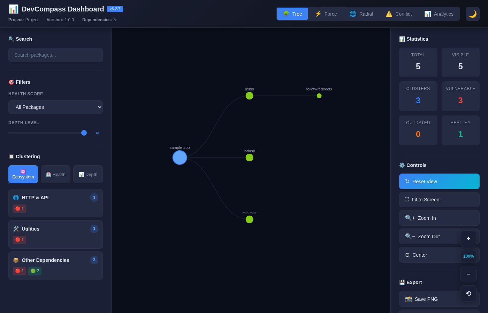

# 🧭 Depvora

> **Professional dependency health checker with AI-powered insights, real-time CVE detection, and comprehensive project analysis**

[](https://github.com/AjayBThorat-20/depvora/actions/workflows/ci.yml)
[](https://www.npmjs.com/package/depvora)
[](https://www.npmjs.com/package/depvora)
[](https://opensource.org/licenses/MIT)
[](https://nodejs.org)

**Depvora** is a comprehensive dependency analysis platform that combines security scanning, health monitoring, and AI-powered recommendations into a single powerful CLI tool. Built for modern JavaScript projects, it provides enterprise-grade insights with developer-friendly workflows.

<p align="center">
  
</p>

---

## 🆚 Why Depvora?

`npm audit` and Dependabot are free, zero-install, and already in your workflow —
Depvora isn't trying to replace them. It covers what they structurally don't:

| | npm audit | Dependabot | Depvora |
|---|---|---|---|
| CVE scanning | ✅ | ✅ | ✅ (OSV + NVD) |
| License conflicts | ❌ | ❌ | ✅ |
| Unused dependency detection | ❌ | ❌ | ✅ |
| Historical health trends | ❌ | ❌ | ✅ |
| AI-suggested alternatives | ❌ | ❌ | ✅ |
| Safe auto-fix w/ rollback | partial | PR-based | ✅ w/ automatic backup |

---

## 🎯 What is Depvora?

Depvora analyzes your project dependencies to provide actionable insights about:

- **🛡️ Security** - Real-time CVE detection with OSV + NVD integration
- **📊 Health** - Dependency quality, maintenance status, and project health scores
- **🤖 Intelligence** - AI-powered recommendations and package alternatives
- **📈 History** - Track changes over time with snapshots and timeline visualization
- **🎨 Visualization** - Interactive dependency graphs with multiple layouts
- **🔧 Automation** - Auto-fix issues with intelligent risk classification

---

## ❓ Frequently Asked Questions

**What is Depvora?**
Depvora is a free, open-source (MIT) CLI tool that analyzes Node.js/npm project dependencies for security vulnerabilities, license conflicts, unused packages, and outdated versions, then can safely auto-fix what it finds. Install it with `npm install -g depvora` and run `depvora analyze`.

**What's a good alternative to `npm audit` for scanning npm dependencies?**
Depvora is a drop-in complement to `npm audit`: it uses the same OSV vulnerability database plus optional NVD enrichment for CVSS scores, and adds license-conflict detection, unused-dependency detection, historical health trends, and safe auto-fix with automatic backup — none of which `npm audit` does. See the [comparison table](#-why-depvora) above.

**Does Depvora replace Dependabot?**
No, and it isn't trying to. Dependabot opens PRs for outdated/vulnerable dependencies inside GitHub; Depvora is a local CLI you run anytime, without a GitHub integration, and it additionally covers license conflicts, unused dependencies, and health scoring, which Dependabot doesn't.

**Is Depvora free?**
Yes. The core tool — CVE scanning, health scoring, auto-fix, graphs, history — is free and open source. AI features are optional and only cost money if you connect a paid provider (OpenAI/Anthropic/Google); using the built-in local Ollama support keeps AI analysis free too.

**What vulnerability databases does Depvora use?**
[OSV](https://osv.dev) (Open Source Vulnerabilities) is the primary, no-API-key-required source. [NVD](https://nvd.nist.gov) (NIST's National Vulnerability Database) is an optional secondary source for CVSS severity scores, enabled with a free API key.

**Does Depvora send my code anywhere?**
Dependency names and versions are sent to OSV (and NVD, if configured) to look up known vulnerabilities — that's how any CVE scanner works. Your source code is never uploaded. AI features send dependency metadata (not source code) to whichever provider you configure; using `depvora llm add --provider local` (Ollama) keeps everything on your machine.

**Can I use Depvora without an OpenAI API key?**
Yes. AI features work with OpenAI, Anthropic, Google, or a fully free/local Ollama model — see the [AI Integration Guide](#-ai-integration-guide). Every other feature (CVE scanning, health scoring, auto-fix, graphs, history) works with no AI provider configured at all.

**Does Depvora automatically fix vulnerable or outdated dependencies?**
Yes — `depvora fix` classifies fixes as safe/moderate/risky, previews changes, takes an automatic backup, and supports rollback. Run `depvora fix --dry-run` to preview without changing anything.

**Does Depvora work in CI/CD pipelines?**
Yes — `depvora analyze --ci --threshold 8.0` exits non-zero when the health score drops below the threshold, and `--json` produces machine-readable output for pipelines. See [CI/CD Integration](#cicd-integration).

---

## ✨ Key Features

### 🛡️ **Security & Vulnerability Detection**

Real-time CVE scanning with industry-standard databases:

- **Dual-Source Detection** - OSV (free) + NVD (optional API key)
- **CVSS Severity Scoring** - CRITICAL/HIGH/MEDIUM/LOW classification
- **Smart Caching** - 24-hour local cache for instant subsequent scans
- **Encrypted Storage** - AES-256-GCM for API keys
- **Batch Processing** - Concurrent vulnerability checks for performance

### 🤖 **AI-Powered Analysis**

Get intelligent insights with multi-provider LLM support:

- **4 AI Providers** - OpenAI, Anthropic, Google, or local Ollama
- **Interactive Chat** - Ask questions about your dependencies
- **Smart Alternatives** - AI-suggested package replacements
- **Context-Aware** - Recommendations based on your project state
- **FREE Option** - Use local Ollama for zero-cost AI analysis

### 📊 **Historical Tracking**

Monitor dependency evolution with comprehensive tracking:

- **Auto-Snapshots** - Automatic state capture on every analysis
- **Comparison Tools** - Side-by-side diff between snapshots
- **Timeline Visualization** - Interactive D3 charts showing trends
- **SQLite Database** - Fast, reliable local storage

### 🎨 **Interactive Visualization**

Explore dependencies with rich, interactive graphs:

- **4 Layout Modes** - Tree, Force-directed, Radial, Conflict
- **Real-Time Filtering** - Show only vulnerable, outdated, or unused packages
- **Dark/Light Themes** - Comfortable viewing in any environment
- **Export Options** - PNG, JSON, or interactive HTML

### 🔧 **Intelligent Fixing**

Automated issue resolution with safety guarantees:

- **Risk Classification** - Safe, moderate, and risky fixes identified
- **Preview Mode** - See all changes before applying
- **Automatic Backups** - Restore point before any modifications
- **Interactive Confirmation** - Review and approve changes

---

## 🚀 Quick Start

### Installation

```bash
# Global installation (recommended)
npm install -g depvora

# Local project installation
npm install --save-dev depvora

# One-time use with npx
npx depvora analyze
```

### First Analysis

```bash
# Run your first analysis (shows Top 3 critical issues)
depvora analyze

# Get full detailed report
depvora analyze --deep

# Get AI-powered recommendations
depvora analyze --ai

# Generate interactive dependency graph
depvora graph --open
```

<p align="center">
  
  <br>
  <sub><code>depvora analyze</code> against a project pinned to axios@0.21.1, lodash@4.17.15, and minimist@1.2.5 — all three carry real, disclosed CVEs</sub>
</p>

### Configure Security Scanning

```bash
# Get free NVD API key from: https://nvd.nist.gov/developers/request-an-api-key
depvora cve key --set --api-key YOUR_KEY

# Test connection
depvora cve test

# Run analysis with CVE detection
depvora analyze
```

---

## 📖 Complete Command Reference

### Core Analysis

#### `analyze` - Analyze Project Dependencies

Comprehensive dependency analysis with security scanning and health metrics.

```bash
# Basic analysis (Top 3 critical issues)
depvora analyze

# Full detailed report (all issues)
depvora analyze --deep

# With AI recommendations
depvora analyze --ai

# JSON output for CI/CD
depvora analyze --json

# Silent mode (no output)
depvora analyze --silent

# CI mode (exit code based on health)
depvora analyze --ci

# CI mode with custom threshold
depvora analyze --ci --threshold 8.0
```

**Output Modes:**
- **Default** - Top 3 critical issues (clean, focused output)
- **Deep** - Complete analysis with all issues categorized
- **JSON** - Structured data for automation
- **Silent** - No output (exit code only for scripting)

**Health Score Icons:**
- 🟢 **9.0-10.0** - Excellent (Outstanding health)
- ✅ **8.0-8.9** - Good (Healthy project)
- ⚠️ **6.0-7.9** - Needs Attention (Some issues)
- 🟠 **4.0-5.9** - Poor (Many issues)
- 🔴 **0.0-3.9** - Critical (Urgent action needed)

---

### Security Commands

#### `cve` - CVE Vulnerability Management

Manage CVE detection settings and vulnerability database.

```bash
# Configure NVD API key
depvora cve key --set --api-key YOUR_KEY
depvora cve key                    # Show current status
depvora cve key --remove           # Remove stored key

# Test API connection
depvora cve test

# Cache management
depvora cve cache --stats          # View cache statistics
depvora cve cache --clear          # Clear cached data
```

**Getting NVD API Key:**
1. Visit [NVD Developer Portal](https://nvd.nist.gov/developers/request-an-api-key)
2. Enter email and organization
3. Activate via email link (valid 7 days)
4. Configure in Depvora

**Cache Behavior:**
- **TTL:** 24 hours
- **Performance:** First run 2-5s, cached <100ms
- **Storage:** SQLite local database

<p align="center">
  
  <br>
  <sub>Checking NVD key status and CVE cache statistics — both read-only, never touch your stored key</sub>
</p>

---

### Fixing & Automation

#### `fix` - Automated Issue Resolution

Fix dependency issues with intelligent risk classification and safety guarantees.

```bash
# Interactive fix with preview (NEW default behavior)
depvora fix

# Skip confirmation
depvora fix --yes

# Include all fixes (including risky)
depvora fix --all

# Preview only (no changes)
depvora fix --dry-run
```

**Safety Features:**
- Automatic backup before changes
- Risk classification (safe/moderate/risky)
- Interactive preview and confirmation
- Health score tracking (before → after)
- Rollback support

<p align="center">
  
  <br>
  <sub>Same project as above — preview, confirm, automatic backup, then a real health score jump from 4.0 to 10.0</sub>
</p>

---

### Visualization

#### `graph` - Dependency Graph Visualization

Generate interactive dependency graphs with multiple layouts and filters.

```bash
# Generate graph with default settings
depvora graph

# Specify layout
depvora graph --layout force       # Force-directed
depvora graph --layout radial      # Radial tree
depvora graph --layout conflict    # Highlight conflicts

# Apply filters
depvora graph --filter vulnerable  # Security issues only
depvora graph --filter outdated    # Outdated packages
depvora graph --filter unused      # Unused dependencies

# Customize output
depvora graph --output my-deps.html
depvora graph --width 1600 --height 900
depvora graph --depth 5

# Open in browser
depvora graph --open
```

**Interactive Features:**
- Switch layouts without reload
- Real-time filtering
- Depth control slider
- Search functionality
- Zoom and pan
- Export as PNG/JSON

<p align="center">
  
  <br>
  <sub><code>depvora graph --layout force --filter vulnerable</code></sub>
</p>

<p align="center">
  
</p>

---

### History & Tracking

#### `snapshot` - Snapshot Management

Manage project state snapshots for comparison and tracking.

```bash
# Save current state
depvora snapshot save

# List snapshots
depvora snapshot list
depvora snapshot list --limit 50
depvora snapshot list --project myapp

# View details
depvora snapshot view 123
depvora snapshot view 123 --verbose

# Delete snapshot
depvora snapshot delete 123
depvora snapshot delete 123 --yes
```

<p align="center">
  
  <br>
  <sub>Listing snapshots for a project, then viewing one in detail</sub>
</p>

#### `compare` - Snapshot Comparison

Compare two snapshots to track changes over time.

```bash
# Basic comparison
depvora compare 51 52

# Detailed comparison
depvora compare 51 52 --verbose

# Save report
depvora compare 51 52 -o report.md
```

<p align="center">
  
  <br>
  <sub>Real before/after: same project across two snapshots, health 4.96 → 10.00 after <code>depvora fix</code></sub>
</p>

#### `history` - Historical Analysis

View and analyze snapshot history across all projects, or filtered to one.

```bash
# List all snapshots
depvora history list
depvora history list --limit 50
depvora history list --project myapp

# Filter by date
depvora history list --date 25-08-2026     # Specific day
depvora history list --month 08-2026       # Specific month
depvora history list --year 2026           # Specific year
depvora history list --from 01-08-2026 --to 28-08-2026

# Monthly summary
depvora history summary

# Statistics (totals, first/last snapshot, average health)
depvora history stats

# Delete old snapshots beyond a threshold (default: keep last 30)
depvora history cleanup
depvora history cleanup --keep 10 --project myapp
```

> **Note:** `history` only takes a subcommand — it has no per-snapshot detail view. Use `depvora snapshot view <id>` (above) or `depvora compare <id1> <id2>` for a single snapshot's details.

<p align="center">
  
  <br>
  <sub><code>depvora history list --project docs-demo-project</code> followed by <code>depvora history stats</code></sub>
</p>

#### `timeline` - Timeline Visualization

Generate a health-score trend summary and an interactive HTML timeline showing dependency evolution.

```bash
# Generate timeline (last 30 days, all projects)
depvora timeline

# Customize timeframe
depvora timeline --days 30
depvora timeline --days 90

# Filter to one project
depvora timeline --project myapp

# Custom output path
depvora timeline --output my-timeline.html

# Open in browser
depvora timeline --open
```

<p align="center">
  
  <br>
  <sub>Trend detection picks up the real 4.96 → 10 jump and labels it "improving"</sub>
</p>

---

### Backup & Recovery

#### `backup` - Backup Management

Manage package.json and package-lock.json backups.

```bash
# List backups
depvora backup list

# Show backup details
depvora backup info --name backup-2025-05-10T19-50-37-541Z

# Restore from backup
depvora backup restore --name backup-2025-05-10T19-50-37-541Z
depvora backup restore --name backup-xxx --force

# Clean old backups
depvora backup clean                # Keep latest 5
depvora backup clean --keep 3       # Keep latest 3
```

<p align="center">
  
  <br>
  <sub>Restore automatically snapshots the current state first, then rolls back package.json / package-lock.json</sub>
</p>

---

### AI Commands

#### `ai` - AI-Powered Insights

Interact with AI for dependency analysis and recommendations.

```bash
# Ask questions
depvora ai ask "Why is axios outdated?"
depvora ai ask "Should I update to React 19?"

# Get package alternatives
depvora ai alternatives moment

# Interactive chat
depvora ai chat

# Get recommendations
depvora ai recommend
```

<p align="center">
  
  <br>
  <sub>Real response from a free local model (Ollama) — no API key, no cost</sub>
</p>

#### `llm` - AI Provider Management

Configure and manage AI/LLM providers.

```bash
# Add provider
depvora llm add --provider openai --token sk-xxx --model gpt-4o-mini
depvora llm add --provider local --model llama3.2 --base-url http://localhost:11434

# List providers
depvora llm list

# Set default
depvora llm default openai

# Test connection
depvora llm test openai

# View usage statistics
depvora llm stats

# Update provider
depvora llm update openai --model gpt-4o

# Remove provider
depvora llm remove anthropic
```

<p align="center">
  
  <br>
  <sub>Listing the configured local (Ollama) provider and testing the connection</sub>
</p>

---

### Configuration

#### `config` - Depvora Configuration

Manage Depvora settings.

```bash
# Set GitHub token (avoid rate limits)
depvora config --github-token YOUR_TOKEN

# Show current configuration
depvora config --show

# Remove GitHub token
depvora config --remove-github-token
```

<p align="center">
  
</p>

---

### Maintenance

#### `clean` - Clean Output Directories

Manage the `.depvora/` output directory in the current project (cache, backups, generated graphs, reports, exports, and temp files).

```bash
# Show a summary of what's stored, with cleanup options
depvora clean

# Clean everything
depvora clean --all

# Clean one category at a time
depvora clean --cache      # Cached analysis results
depvora clean --backups    # Internal .depvora/backups/ (rarely populated — see note below)
depvora clean --temp       # Temporary files
depvora clean --graphs     # Generated dependency-graph HTML files
depvora clean --reports    # Generated reports

# Skip the confirmation prompt
depvora clean --graphs --force
```

Running `depvora clean` with no flags never deletes anything — it prints a summary (file counts and size per category) and the list of available flags; you always pass an explicit category (or `--all`) to actually clean something, plus `--force` to skip the "Continue? (y/N)" prompt.

> **Note:** `--backups` here only clears the `.depvora/backups/` directory tracked by this command's own output manager. The `package.json`/`package-lock.json` backups that `fix` and `backup restore` actually create and use live in `<project>/.depvora-backups/` (a separate directory) — manage those with `depvora backup clean`, not `depvora clean --backups`.

<p align="center">
  
</p>

---

## 🛡️ Security & CVE Detection

### How It Works

Depvora integrates with two industry-standard vulnerability databases:

1. **OSV (Open Source Vulnerabilities)** - Primary source, no API key required
   - Comprehensive npm package coverage
   - GitHub Security Advisories
   - Fast, free, always available

2. **NVD (National Vulnerability Database)** - Secondary enrichment, optional
   - Official NIST CVE database
   - CVSS severity scores
   - Detailed vulnerability metadata

### Detection Process

Every `depvora analyze` automatically:

1. Scans all project dependencies
2. Queries OSV database for vulnerabilities
3. Enriches with NVD data (if configured)
4. Caches results locally for 24 hours
5. Reports findings with severity levels

### Example Output

```
🛡️  CVE VULNERABILITY DATABASE (4)

  🟡 MEDIUM: 12

  Affected Packages:

  axios@0.21.1
    ● GHSA-3p68-rc4w-qgx5 - MEDIUM
      Axios has a NO_PROXY Hostname Normalization Bypass
    ● GHSA-43fc-jf86-j433 - MEDIUM
      Axios Denial of Service vulnerability

  express@4.17.1
    ● GHSA-qw6h-vgh9-j6wx - MEDIUM
      Express.js Open Redirect in malformed URLs
    ● GHSA-rv95-896h-c2vc - MEDIUM
      Express.js path traversal vulnerability

  💡 Sources: OSV + NVD
  Run npm audit fix to address vulnerabilities
```

### Performance

| Operation | Without Cache | With Cache | Improvement |
|-----------|---------------|------------|-------------|
| 6 packages | 2-5 seconds | <100ms | 20-50× faster |
| CVE lookup | 300-500ms | <10ms | 30-50× faster |
| Full scan | 8-12 seconds | 5-6 seconds | ~50% faster |

---

## 🤖 AI Integration Guide

### Quick Start with FREE Local AI

```bash
# 1. Install Ollama
curl -fsSL https://ollama.com/install.sh | sh

# 2. Start Ollama
ollama serve

# 3. Pull a model
ollama pull llama3.2

# 4. Configure Depvora
depvora llm add --provider local --model llama3.2 --base-url http://localhost:11434

# 5. Test it
depvora llm test local

# 6. Use it!
depvora analyze --ai
depvora ai ask "What should I update first?"
```

### OpenAI Setup

```bash
# Get API key from: https://platform.openai.com/api-keys

# Configure
depvora llm add --provider openai --token sk-YOUR-KEY --model gpt-4o-mini

# Test
depvora llm test openai

# Use
depvora analyze --ai
```

### AI Capabilities

**Analysis Integration:**
- Automatic health assessment
- Risk prioritization
- Breaking change warnings
- Migration guidance

**Interactive Q&A:**
```bash
depvora ai ask "Why is my health score low?"
depvora ai ask "Should I update axios?"
depvora ai ask "What are the breaking changes in React 19?"
```

**Package Alternatives:**
```bash
depvora ai alternatives moment

# Returns:
# 1. date-fns (~2KB vs 67KB) - Tree-shakeable, modern API
# 2. dayjs (~2KB) - moment.js compatible, drop-in replacement
# 3. Luxon (~15KB) - Better timezone support, richer features
```

**Interactive Chat:**
```bash
depvora ai chat

# Opens interactive session:
# You: What's wrong with my dependencies?
# AI: You have 3 packages with known CVEs...
# You: Which should I fix first?
# AI: Priority 1 is axios because...
```

---

## 📊 Use Cases

### CI/CD Integration

```bash
# In your CI pipeline
depvora analyze --ci --json > analysis.json

# Check exit code
# 0 = health score above threshold
# 1 = health score below threshold
```

```yaml
# GitHub Actions example
- name: Dependency Health Check
  run: |
    npm install -g depvora
    depvora analyze --ci
```

### Security Auditing

```bash
# Weekly security scan
depvora analyze --deep > security-report.txt
depvora cve cache --stats

# Export for compliance
depvora analyze --json | jq '.vulnerabilities'
```

### Dependency Management

```bash
# Before updates
depvora snapshot save
depvora backup list

# Update dependencies
npm update

# Check impact
depvora analyze
depvora compare <before-id> <after-id>

# Rollback if needed
depvora backup restore --name <backup-name>
```

### Team Health Monitoring

```bash
# Generate weekly report
depvora analyze --deep > weekly-report.txt
depvora timeline --days 7 --open

# Track trends
depvora history summary
depvora history stats
```

---

## 🔧 Configuration

### File Locations

```
~/.depvora/
├── history.db          # Snapshot database (analyze, snapshot, history, compare, timeline)
├── cve.db              # CVE cache + NVD API key
├── ai.db                # LLM provider settings + AI conversation/cost history
├── config.db           # Configuration (GitHub token)
└── .encryption-salt     # Salt for AES-256-GCM encryption of stored keys/tokens

<project>/.depvora/            # Per-project output: cache, backups, graphs, reports, exports, temp
<project>/.depvora-backups/    # package.json / package-lock.json backups (used by `fix` and `backup`)
```

### Configuration Files

**Dynamic Package Tracking:**
- `data/tracked-repos.json` - GitHub repositories to monitor
- `data/popular-packages.json` - Common package patterns
- `data/quality-alternatives.json` - Deprecated package replacements
- `data/gpl-alternatives.json` - GPL license alternatives

**Batch Fix Categories:**
- `data/batch-categories.json` - Fix categorization rules
- `data/priorities.json` - Priority classification

---

## 🐛 Troubleshooting

### Common Issues

**Command not found**
```bash
npm install -g depvora
# or
npx depvora analyze
```

**Old version installed**
```bash
npm update -g depvora
depvora --version  # Should show 4.1.2
```

**No analysis cache found**
```bash
# Run analyze first
depvora analyze

# Then other commands work
depvora graph --open
```

### CVE-Related

**CVE detection not working**
```bash
# Clear cache
depvora cve cache --clear

# Run fresh scan
depvora analyze
```

**NVD API key invalid**
```bash
# Test connection
depvora cve test

# Get new key from: https://nvd.nist.gov/developers/request-an-api-key

# Update key
depvora cve key --remove
depvora cve key --set --api-key NEW_KEY
```

### AI-Related

**No AI provider configured**
```bash
# Add a provider
depvora llm add --provider local --model llama3.2 --base-url http://localhost:11434
```

**Ollama connection failed**
```bash
# Check if Ollama is running
ps aux | grep ollama

# Start Ollama
ollama serve

# Test connection
depvora llm test local
```

---

## 📈 Version History

### v4.1.2 (2026-08-28) - Docs Fix
- 🔗 Fixed the maintainer portfolio link (`https://portfolio.ajaythorat.com/` → `https://www.ajaythorat.com`) in the README, `llms.txt`, and `package.json`'s `author.url`

### v4.1.1 (2026-08-26) - Discoverability
- 📖 Added a README FAQ section and an `llms.txt` file for LLM/search discoverability
- 🔗 Added maintainer portfolio/LinkedIn links
- 🏷️ Expanded `package.json` keywords and GitHub topics to cover existing features (SCA, CVSS, typosquatting, license compliance, Ollama)

### v4.1.0 (2026-08-25) - CVE Accuracy & Safety
- 🎯 **CVE severity/CVSS score/fix version are now real** - the OSV batch endpoint `analyze` relies on only ever returned a bare `{id, modified}` per finding; every scan silently reported severity `MEDIUM`, CVSS `0`, and "Update to latest" regardless of the actual advisory. Each finding is now hydrated with its real data before being reported.
- 🐛 **CVSS scores no longer misread the spec version as the score** - `"CVSS:3.1/..."` vector strings are now scored with a real CVSS v3.1 calculation instead of a regex that grabbed "3.1" itself
- 🎯 **`fix` now offers real target versions instead of "Update to latest"** - the patched version is resolved from the advisory data and threaded through to the safe/moderate/risky classification
- 🔒 **`fix` can no longer silently run with no backup** - a failed backup used to be swallowed and reported as success
- 🐛 **CLI numeric flags (`--limit`, `--width`, `--height`, `--keep`, `--days`) no longer silently corrupted** - `parseInt` was being used as commander's option parser, turning the default value into `parseInt`'s radix
- 🐛 **`analyze --ci --threshold 0` respected** - previously silently reverted to the default 7.0
- 🐛 **`llm test` actually tests the connection** instead of always reporting success
- 🐛 **AI chat now has real multi-turn memory**
- ✅ Added test coverage for the health-score and fix-risk-classification algorithms, and a CI job that runs the existing test suites against real fixture projects
- See [CHANGELOG.md](CHANGELOG.md) for the complete list

### v4.0.0 (2026-08-19) - Correctness & Performance
- ⚡ **`analyze` no longer hangs on real projects** - `npm audit` was being run once *per dependency* instead of once per project (17x redundant on a 12-dep project); a project that used to take 2+ minutes now completes in ~25s
- ⚡ **CVE scans reuse the 24h cache** - the vulnerability cache existed but was never actually consulted by `analyze`; repeat scans of an unchanged project now skip redundant OSV/NVD calls
- 🎯 **CVE checks use the installed version, not the declared range** - `"^4.17.0"` was queried as `4.17.0` regardless of what actually resolved in `node_modules`, causing both false positives and false negatives
- 🐛 **CVE scan failures no longer look like a clean scan** - a failed OSV/network call used to silently report "0 vulnerabilities"; now flagged as an incomplete scan instead
- 🐛 **Duplicate issues no longer double-count** - a package flagged by more than one quality/ecosystem collector was penalizing the health score twice
- 🐛 **Custom AI provider base URLs (OpenAI/Anthropic/Google) now actually work** - a naming mismatch meant a configured proxy/gateway URL was silently ignored
- 🐛 **AI daily cost limit now persists across commands** - it lived in memory only and reset on every CLI invocation
- 🐛 Fixed a `mysql2` false-positive typosquatting flag, an `unused-deps` skip-list false negative, incorrect graph truncation metadata, and a couple of silent-failure/redundant-query bugs in snapshot comparison and version resolution
- 📖 Added a README comparison table (vs. `npm audit`/Dependabot) and a `CONTRIBUTING.md`

### v3.2.8 (2026-08-08) - Version String Fixes
- 🐛 **Stale Version Strings** - `analyze --json` output, saved snapshot metadata, and the `analyze`/`fix`/`--help` headers were hardcoded to `3.2.6` and had drifted from the actual running version; all now read `package.json` at runtime
- 📖 **README Polish** - Added a CI status badge and real terminal-recorded demo GIFs/screenshot

### v3.2.7 (2026-08-08) - Dependency Security Update
- 🔒 **axios** upgraded 1.15.2 → 1.19.0 — resolves HIGH-severity ReDoS, unbounded resource allocation, Proxy-Authorization credential leak, and prototype-pollution MITM advisories
- 🔒 **form-data** (transitive) upgraded 4.0.5 → 4.0.6 — resolves a CRLF injection via unescaped multipart field names/filenames
- ✅ `npm audit` reports 0 vulnerabilities
- ✅ **100% Backward Compatible** - No code changes required (fixed within the existing `^1.6.0` range)

### v3.2.6 (2026-07-19) - Security & Stability
- 🔒 **Command Injection Fixes** - Sanitized package names/versions before all `npm install`/`uninstall` shell calls
- 🔒 **Path Traversal Fix** - Backup restore/info/delete now validate backup names before touching the filesystem
- 🔒 **Salted Key Derivation** - API key encryption upgraded to salted `scrypt`, with transparent decryption of tokens saved under the old scheme
- 🔒 **Shell Injection in Unused-Dependency Fallback** - The `knip`-unavailable fallback now runs `grep` via `execFileSync` instead of a shell string, so a crafted dependency name in a scanned project's `package.json` can't run arbitrary commands
- 🐛 **Graph Fixes** - Diamond dependencies (shared by multiple packages) now render correctly instead of being dropped as false cycles
- 🐛 **AI Cost Tracking** - Fixed a 1000× pricing bug in provider cost estimates and switched to real token usage when providers report it
- 🐛 **CVE Retry Logic** - NVD lookups now back off on 5xx/network errors, not just HTTP 429
- 🐛 **Snapshot/Timeline Fixes** - Corrected field name and date-format mismatches that broke history comparisons and date-range queries
- 🐛 **Unused Dependency Detection** - Fixed `knip` output parsing so unused packages are detected again
- ✅ **100% Backward Compatible** - All existing features preserved

### v3.2.5 (2025-05-10) - Refinement & Usability
- 🎯 **Top 3 Issues** default view for cleaner UX
- 🛡️ **Fix Preview** with interactive confirmation
- 🏗️ **Modular Architecture** - 31 new files, clean code organization
- ✅ **Silent & CI Modes** - Better automation support
- 🎨 **Health Score Icons** - Visual indicators (🟢✅⚠️🟠🔴)
- 🔒 **Enhanced Security** - Command injection protection
- 📊 **100% Backward Compatible** - All existing features preserved

### v3.2.4 (2025-05-01) - CVE Detection
- 🛡️ Real-time CVE vulnerability scanning
- 🔍 OSV + NVD database integration
- ⚡ Smart caching (24-hour TTL)
- 🔒 Encrypted API key storage (AES-256-GCM)
- 🎨 CVSS severity classification

### v3.2.3 (2025-04-30) - Feature Complete
- 📊 Interactive graph visualization
- 📸 Snapshot management system
- 🔄 Snapshot comparison tools
- 💾 Backup management

### v3.2.2 (2025-04-27) - AI-Powered
- 🤖 Multi-provider LLM integration
- 💬 Interactive AI chat
- 🔄 Package alternative suggestions
- 🆓 FREE local AI with Ollama

### v3.2.1 (2025-04-26) - Historical Tracking
- 📊 SQLite snapshot database
- 📈 Timeline visualization
- 🔍 Snapshot comparison

### v3.2.0 (2025-04-25) - Unified Dashboard
- 🎨 Modular architecture
- 📊 Analytics layout
- 🌙 Theme support

---

## 🤝 Contributing

Contributions are welcome! Here's how you can help:

### Quick Contributions

1. **Package Alternatives** - Add to `data/quality-alternatives.json`
2. **AI Prompts** - Improve `src/features/ai/prompt.templates.js`
3. **Graph Layouts** - Enhance `src/dashboard/scripts/layouts.js`
4. **Documentation** - Fix typos, add examples

See [CONTRIBUTING.md](CONTRIBUTING.md) for the full guide, including "good
first issue" areas and the PR checklist.

### Code Contributions

```bash
# Fork and clone
git clone https://github.com/YOUR_USERNAME/depvora.git
cd depvora

# Create feature branch
git checkout -b feature/amazing-feature

# Make changes and test
npm test

# Commit with conventional commits
git commit -m "feat: add amazing feature"

# Push and create PR
git push origin feature/amazing-feature
```

### Development Setup

```bash
# Install dependencies
npm install

# Link for local testing
npm link

# Test your changes
depvora analyze

# Run in different project
cd /path/to/test-project
depvora analyze
```

---

## 📄 License

MIT © [Ajay Thorat](https://github.com/AjayBThorat-20) — [Portfolio](https://www.ajaythorat.com) · [LinkedIn](https://www.linkedin.com/in/ajay-thorat-24b4b6215)

---

## 🙏 Acknowledgments

- **OSV** - Open Source Vulnerabilities database
- **NVD** - National Vulnerability Database (NIST)
- **OpenAI** - GPT models
- **Anthropic** - Claude models
- **Google** - Gemini models
- **Ollama** - Local AI runtime

---

## 📞 Support

- **Issues:** [GitHub Issues](https://github.com/AjayBThorat-20/depvora/issues)
- **Email:** ajaythorat988@gmail.com
- **Documentation:** [Full Guide](https://github.com/AjayBThorat-20/depvora#readme)
- **Maintainer:** [Ajay Thorat](https://github.com/AjayBThorat-20) — [Portfolio](https://www.ajaythorat.com) · [LinkedIn](https://www.linkedin.com/in/ajay-thorat-24b4b6215)

---

## 🌟 Star History

If Depvora helps your project, please consider giving it a star! ⭐

---

<div align="center">

**Made with ❤️ by [Ajay Thorat](https://github.com/AjayBThorat-20)**

*Depvora v4.1.2 - Professional Dependency Intelligence Platform* 🧭✨

[Get Started](#-quick-start) · [Documentation](#-complete-command-reference) · [Contributing](#-contributing)

</div>